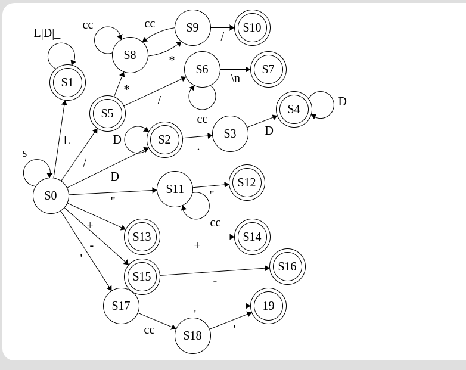
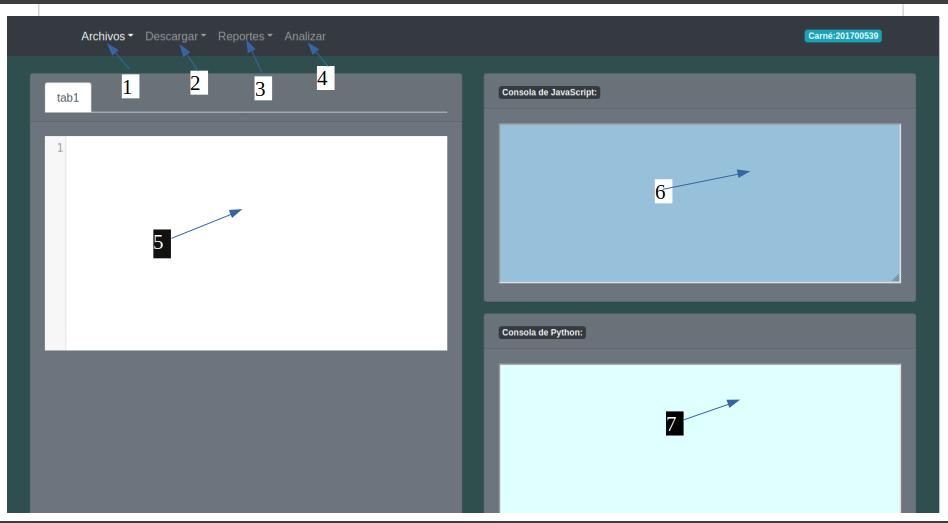
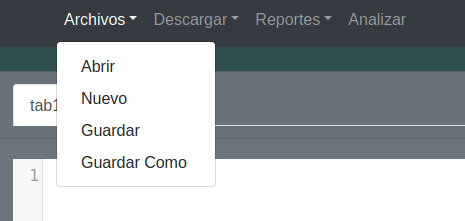
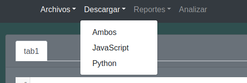
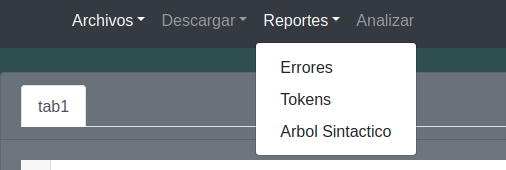

## Manual Tecnico

#### Comandos Importantes
- Las peticiones se hacen de js->go->nodejs  nodejs->go->js

- Utilizar eclipse para colorear codemirror

* Comandos para subir las imagenes a docker hub:
>sudo docker login
>sudo docker tag node:v1 user/node:v1
>sudo docker push user/node:v1

#### Requisitos
- [Docker en la versión más reciente](https://www.digitalocean.com/community/tutorials/how-to-install-and-use-docker-on-ubuntu-20-04-es "Docker en la versión más reciente")
- Sistema Operativo Linux
- [Graphviz](http://zoomadmin.com/HowToInstall/UbuntuPackage/graphviz "Graphviz")

#### Especificaciones
1. Se hizo uso de golang para levantar la pagina web
2. Para la parte del backend se construyeron dos ApiRest con nodejs, javascript y typescrip. Mediante esta se puede hacer peticiones desde el frontend hacia el backend y recibir respuesta.
3. Se creo un analizador lexico y sintactico con typescript y se implemento en la traducción del codigo java a codigo python. 
4. Se utilizó jison para crear un analizador lexico-sintactico que nos permitiera crear un arbol sintactico de la cadena analizada y una traducción de java a javascript.
5. Se uso CodeMirror para darle una mejor apariencia al area de texto de java.
6. Se uso bootstrap para crear el frontend de la página.
7. Se utilizó Docker para que la aplicacción la pueda ejecutar otra persona sin intalar tantas cosas. Se dockerizó la parte de Go y las dos API-REST's.

#### Grámatica Utilizada para analizador lexico-sintactico jison
```
INICIO::= L_PRINCIPAL

L_PRINCIPAL::= L_PRINCIPAL INST
                | INST

INST::=CLASE
        |SENT_IMPORT

CLASE::= rclass id llaveizq L_CLASE llaveder

L_CLASE::= L_CLASE INSTCLASE
            | INSTCLASE

INSTCLASE::= DECLARACION puntoycoma
            |METODO
            |FUNCION
            | CONSTRUCT

CONSTRUCT::= id parizquierdo VARIABLES parderecho BLOQUE 
            | id parizquierdo parderecho BLOQUE

FUNCION::= T PROFUNDIDAD id BLOQUEF BLOQUE 
           |T  id BLOQUEF BLOQUE  
           |id PROFUNDIDAD id BLOQUEF BLOQUE {
           |id  id BLOQUEF BLOQUE
;


BLOQUEF::= parizquierdo VARIABLES parderecho 
            |parizquierdo parderecho 

L_INSTRUCCIONES ::= L_INSTRUCCIONES INSTRUCCION
                            | INSTRUCCION
                           
L_CASOS ::=L_CASOS rcase VALORES dospuntos L_INSTRUCCIONES
            |L_CASOS rdefault dospuntos L_INSTRUCCIONES
          | CASOS

INSTRUCCION ::= DECLARACION puntoycoma
            | RETURN puntoycoma 
            | ACCESO puntoycoma
            | LLAMADA puntoycoma 
            | M puntoycoma
            | INSTOBJETO puntoycoma 
            | ASIGNACION puntoycoma
            | IMPRIMIR puntoycoma
            | SENTENCIA_IF
            | ARREGLO puntoycoma
            | SENT_WHILE
            | SENT_DOWHILE
            | BREAK
            | CONTINUE
            | SENT_FOR
            | SENT_SWITCH

ARREGLO::= T PROFUNDIDAD id igual A
           |T PROFUNDIDAD id igual rnew T PROF
           |T PROFUNDIDAD id igual LLAMADA
           |T PROFUNDIDAD id igual ACCESO
           |id PROFUNDIDAD id igual A
           |id PROFUNDIDAD id igual rnew id PROF
           |id PROFUNDIDAD id igual LLAMADA
           |id PROFUNDIDAD id igual ACCESO

PROFUNDIDAD::= PROFUNDIDAD corizquierdo corderecho
                |corizquierdo corderecho

INSTOBJETO::= id id igual E 
               | id id
               

ACCESO::= id punto id LLAMA 
            |id punto id
            | rthis punto id LLAMA
            | rthis punto id

LLAMA::=  parizquierdo PARAMETROS parderecho
        |parizquierdo parderecho 
        

METODO::=rvoid id parizquierdo VARIABLES parderecho BLOQUE
            |rvoid id parizquierdo  parderecho BLOQUE

VARIABLES::= VARIABLES coma T id
            |T id

DECLARACION ::= 
        T id igual E 
        | T id
        
       

FORD::= DECLARACION
        | ASIGNACION

ASIGNACION ::=    id igual E
                | id punto id igual E
                | rthis punto id igual E

PARAMETROS::= E
              |PARAMETROS coma E

LLAMADA::= id parizquierdo PARAMETROS parderecho 
              | id parizquierdo  parderecho

T ::= rint 
    | rchar 
    | rboolean 
    | rdouble 
    | rstring 


IMPRIMIR ::= rsystem punto rout punto rprintln parizquierdo E parderecho
                | rsystem punto rout punto rprint parizquierdo E parderecho
               

SENTENCIA_IF ::= L_CONDICIONES relse BLOQUE
                |L_CONDICIONES


L_CONDICIONES ::= L_CONDICIONES relse rif parizquierdo E parderecho BLOQUE
                    | rif parizquierdo E parderecho BLOQUE

BLOQUE::= llaveizq llaveder 
            | llaveizq L_INSTRUCCIONES llaveder 
            

RETURN::= rreturn E
           | rreturn 


CASOS ::=  rcase VALORES dospuntos L_INSTRUCCIONES
            |rdefault dospuntos L_INSTRUCCIONES

SENT_SWITCH ::= rswitch parizquierdo id parderecho llaveizq L_CASOS llaveder
                |rswitch parizquierdo id parderecho llaveizq  llavede

SENT_FOR ::= rfor parizquierdo FORD puntoycoma E puntoycoma FORAUM parderecho BLOQUE

FORAUM::= ASIGNACION
          | M

BREAK ::= rbreak puntoycoma 

CONTINUE ::= rcontinue puntoycoma 

SENT_WHILE ::= rwhile parizquierdo E parderecho BLOQUE

SENT_DOWHILE ::= rdo BLOQUE rwhile parizquierdo E parderecho puntoycoma 

VALORES ::= entero
        | caracter
        | rtrue 
        | rfalse
        | doble
        | cadena
        | rnull

SENT_IMPORT ::= rimport cadena puntoycoma 

E ::=   VALORES
        | rnew id parizquierdo PARAMETROS parderecho
        | rnew id parizquierdo parderecho
        | E mas E
        | E por E
        | parizquierdo E parderecho  
        | E division E
        | menos E
        | M
        | E menos E
        | E modulo E
        | E potencia E      
        | E mayorque E
        | E menorque E
        | E mayorigualque E
        | E menorigualque E
        | E igualigual E
        | E diferenteque E
        | E or E
        | E and E
        | E xor E
        | not E
        | id PROF punto id LLAMA
        | id PROF punto id
        | id PROF
        | id
        | N
```

#### AFD para analizador lexico hecho en typescript
[](http://Imagenes/afd.png "AFD")
#### Grámatica utilizada para el segundo analizador sintactico hecho con typescript
```
INICIO::=CLASES
            
CLASES::= CLASE CLASES
         |

CLASE::= rpublic TCLASS id BLOQUEC

TCLASS::= rclass
            |rinterface

BLOQUEC::= llaveizq INSTCLASE llaveder

INSTCLASE::= rpublic FUNMET 
            |T DECLARACION puntoycoma
            |

FUNMET::= T_FM id parizq T id PARAMETROS parder T_IC
            |rstatic rvoid rmain parizq rstring corizq corder args parder BLOQUEI

T_IC::= puntoycoma
        | BLOQUEI


T_FM::= rvoid
        |T

T::= rint
    |rdouble
    |rboolean
    |rstring
    |rchar

PARAMETROS::=  coma T id PARAMETROS
                |

BLOQUEI::= llaveizq INSTRUCCIONES llaveder

INSTRUCCIONES::= INSTRUCCION INSTRUCCIONES
                | 

INSTRUCCION::= rfor FOR
                | rwhile WHILE
                | rdo DOWHILE
                | rif IF_
                | rbreak puntoycoma
                | continue puntoycoma
                | rreturn EXP puntoycoma
                | id ASIG_LLAMA puntoycoma
                | rsystem IMPRIMIR puntoycoma
                | T DECLARACION puntoycoma

IMPRIMIR::= punto rout punto IMPRIMIR_1 parizq EXP parder

IMPRIMIR_1::= rprint 
                |rprintln 

ASIG_LLAMA::= igual EXP
            | parizq EXP VALORES parder
            | masmas
            | menosmenos 

VALORES::= coma EXP VALORES
            |


DECLARACION::= id ASIGNACION VAL2

VAL2::= coma id ASIGNACION VAL2
        |

ASIGNACION::= igual EXP
                |

FOR::= parizq T id igual EXP puntoycoma EXP puntoycoma EXP_AD parder BLOQUEI

WHILE::= parizq EXP parder BLOQUEI

DOWHILE::= BLOQUEI rwhile parizq EXP parder puntoycoma

IF_::= parizq EXP parder BLOQUEI ELSE_

ELSE_::= relse ELSE_1
        | 

ELSE_1::= rif IF_
        | BLOQUEI


EXP::= A

A::= B A'

A'::=or or B A'
    |

B::=C B'

B'::= xor C B'
    |

C::= D C'

C'::= and and D C'
    |

D::= E D'

D'::= igual igual E D'
        |diferente E D'
        |

E::= F E'

E'::=menor E''
    |mayor E''
    |
    
E''::=igual F E'
        |F E'

F::= G F'

F'::=mas G F'
    |menos G F'
    |

G::= H G'

G'::=por H G'
    | dividir H G'
    |

H::=id J
    |K

J::=masmas
    |menosmenos
    |parizq VALORES parder
    |

K::=(A)
    |VALOR


VALOR::=cadena
        |caracter
        |entero
        |double
        |rtrue
        |rfalse
```
#### Comandos para levantar servidores con docker
1. Se proecede a instalar docker en su maquina ubuntu
[Instalacion de Docker en Ubuntu 20.04](https://www.digitalocean.com/community/tutorials/how-to-install-and-use-docker-on-ubuntu-20-04-es)
2. Descargar imagen desde docker hub
	```
	docker pull alexandermca/goweb:latest
	docker pull alexandermca/nodewebpy:latest
	docker pull alexandermca/nodewebjs:latest

	```
	Aca las imagenes ya han sido instaladas
3.  Se procede a instalar docker-compose
	[Instalacion de docker-compose en Ubuntu 20.04](https://www.digitalocean.com/community/tutorials/how-to-install-and-use-docker-compose-on-ubuntu-20-04-es)
4. Luego se precede a  ejecutar el archivo docker-compose
	    sudo docker-compose up
5. Para parar la ejecucion de los servidores se escribe el siguiente comando:
	    docker-compose down

## Manual de Usuario

------------

[](http://Imagenes/inicioweb.png "GUI")

#### Opciones
- **Opción 1**
	[](http://Images/archivos.png "Opcion1")
	- **Abrir:**
		Esta opción le permitira abrir archivos con extensión .java dentro del area del editor (Opcion 5)
	- **Nuevo**
		Esta opción le permitira crear un nuevo editor
	- **Guardar:**
		Esta opción le permitira guardar lo que tenga escrito en el editor actual. Se guardara con el nombre que tenga la pestaña.
	- **Guardar Como:**
		Esta opción le permitira guardar lo que tenga escrito en el editor actual, solo que le preguntará antes por el nombre con el que quiere guardar el archivo. Seguira siendo con extension .java.
- **Opción 2**
	[](http://Imagenes/descargas.png "Opcion2")
	- **Ambos:**
		Esta opción descargará dos archivos, uno .py que contendra la traduccion a Python de lo analizado y otro .js con la traducción al lenguaje javascript.
	- **JavaScript:**
		Descargara un archivo .js con la traduccion a Javascript de lo analizado.
	- **Python:**
		Descargará un archivo .py con la traducción a Python de lo analizado.
- **Opción 3**
	[](http://Imagenes/reportes.png "Opcion3")
	- **Errores:**
		Esta opción descargará dos archivo html con la información de los errores que surgieron durante el analisis lexico sintactico de la información del editor (Opcion 5), uno provendra de la API-REST que contiene el analizador hecho con jison y el otro de la API-REST que contiene los analizadores hechos con typescript.
	- **Tokens:**
		Esta opción descargara un archivo html que contendra una tabla con todos los tokens que se obtuvieron del analasis lexico sintactico.
	- **Arbol Sintactico:**
		Esta opción se encargara de descargar un archivo svg con la grafica del arbol de analisis sintactico para la entra del editor(Opción 5), esta fue generada con graphviz.
- **Opción 4:**
	Esta opción se encarga de iniciar el analisis lexico-sintactico de la entrada, analiza la entrada y devuelve la traduccion en las consolas js y py. Ademas abre ventanas emergentes que contendran reportes de lo analizado.
- **Opción 5:**
	Es un editor de texto donde podra visualizar la informacion de sus archivos y lo que quiere analizar.
- **Opción 6:**
	Es la consola de Javascript, acá se mostrará la traducción y errores si es que los hay de lo analizado de la entrada.
- **Opción 7:**
	Es la consola de Python, acá se mostrará la traducción y errores si es que los hay de lo analizado de la entrada.
